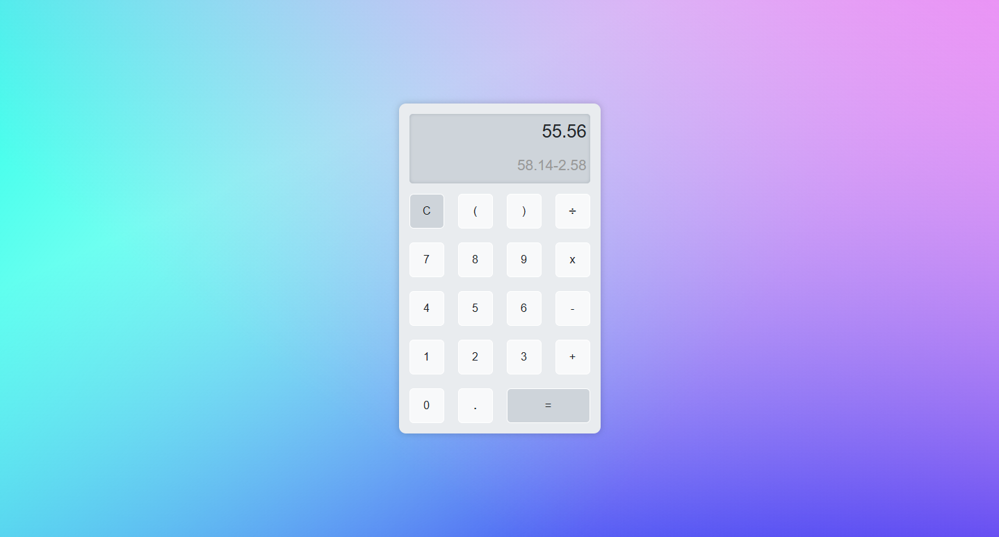

# Calculatrice en JavaScript

Ce projet est une application web simple de calculatrice développée en HTML, CSS et JavaScript.

## Fonctionnalités

- Calculs arithmétiques de base (addition, soustraction, multiplication, division)
- Gestion des erreurs (division par zéro, erreurs de syntaxe)
- Affichage de l'historique des calculs

## Aperçu



## Technologies utilisées

- HTML5
- CSS3
- JavaScript

## Installation

1. Clonez le dépôt sur votre machine locale :
    ```sh
    git clone https://github.com/Github-MitchD/calculatrice_js.git
    ```

2. Ouvrez le fichier `index.html` dans votre navigateur pour utiliser la calculatrice.

## Structure du Projet

Le projet est structuré comme suit :

- `index.html` : Le fichier HTML principal qui contient la structure de l'application.
- `script.js` : Le fichier JavaScript qui contient la logique de la calculatrice et les interactions utilisateur.
- `style.css` : Le fichier CSS qui contient les styles de l'application.

## Utilisation

1. Ouvrez le fichier `index.html` dans un navigateur web.
2. Utilisez les boutons de la calculatrice pour effectuer des calculs.
3. Le résultat s'affiche sur l'écran de la calculatrice, avec l'historique des calculs précédents.

## Contributions

Les contributions sont les bienvenues ! Si vous avez des idées d'améliorations ou des bugs à signaler, n'hésitez pas à ouvrir une issue ou à soumettre une pull request.

## Licence

Ce projet est sous licence MIT. Voir le fichier LICENSE pour plus de détails.

---

Développé avec ❤️ par [Michel Dufour](https://micheldufour.fr/)